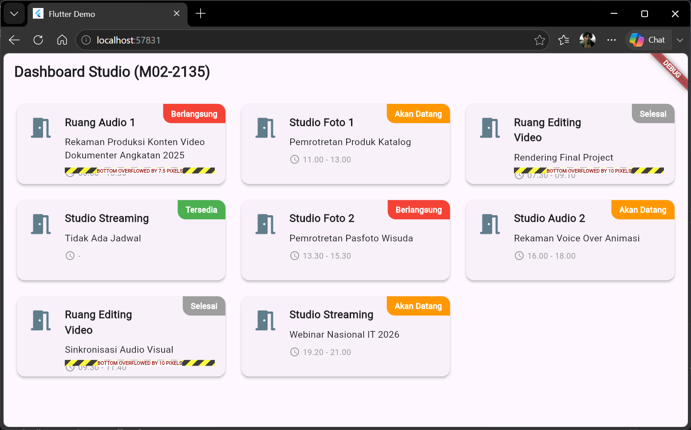
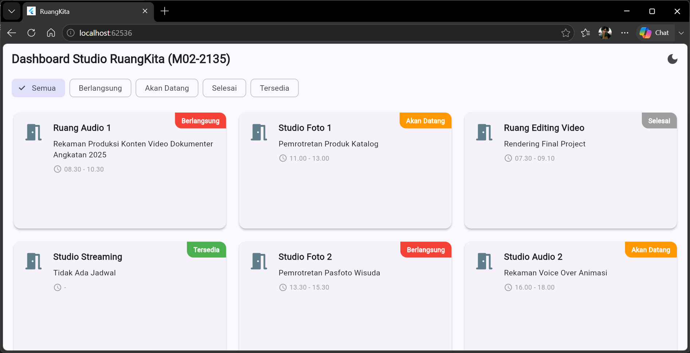

# Catatan Debugging (Layout & Overflow)

Dokumen ini mencatat masalah *layout* yang ditemukan selama pengembangan aplikasi dan strategi penyelesaiannya, yang menegaskan pentingnya pemahaman aturan constraint (*Constraints go down, sizes go up, parent sets position*) pada Flutter.

## Kasus 1: "Bottom Overflowed" pada GridView Kartu Ruangan

**Gejala Masalah (Symptoms):**
Muncul peringatan garis kuning-hitam di batas bawah kartu ruangan bertuliskan *"BOTTOM OVERFLOWED BY X PIXELS"* (seperti yang terekam pada `image_0b0ca0.png` dan `image_927087.png`). Isu ini secara spesifik hanya muncul ketika aplikasi beralih ke ukuran *Medium/Expanded* yang memicu perenderan `GridView`.

**Akar Masalah (Root Cause):**
Masalah bersumber dari kombinasi batas tinggi vertikal dan panjang teks:
1. Properti `childAspectRatio` pada konfigurasi `SliverGridDelegateWithFixedCrossAxisCount` diatur terlalu besar (contoh awal: `2.5`). Ini memaksa dimensi kartu menjadi terlalu pipih (lebar tetapi sangat pendek).
2. Teks `roomName` dan `activityName` yang berjumlah lebih dari 35 karakter melipat menjadi dua baris di layar sempit. 
Total tinggi dari teks yang melipat (*wrapping*) pada `Column` ternyata melebihi ruang vertikal (*height constraint*) yang disediakan oleh kartu pipih tersebut, sehingga konten terpotong dan memicu *overflow* ke arah bawah.

**Solusi & Implementasi (Solution):**
Penyelesaian dilakukan dengan dua penyesuaian untuk mengatur ukuran ruang dan teks:
1. **Mengurangi `childAspectRatio`**: Nilai diturunkan dari `2.5` menjadi `1.4` (atau `1.8` sesuai penyesuaian kolom) agar tinggi (tinggi proporsional) dari *Card* lebih luas.
2. **Menambahkan Batas Baris pada Teks**: Menambahkan properti `maxLines: 1` pada judul `roomName` dan mempertahankan `maxLines: 2` pada `activityName` yang dikombinasikan dengan properti `overflow: TextOverflow.ellipsis`.

Kedua hal ini menjamin tinggi *Column* tetap stabil dan tidak melampaui ukuran kontainer *Card*.

**Bukti Penyesuaian:**
* **Sebelum:**
* **Sesudah:**