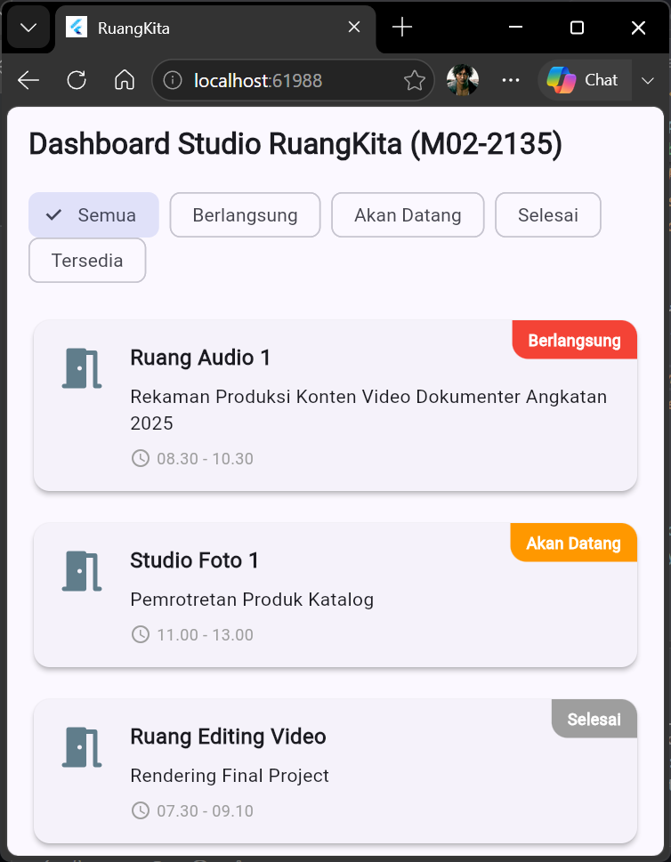
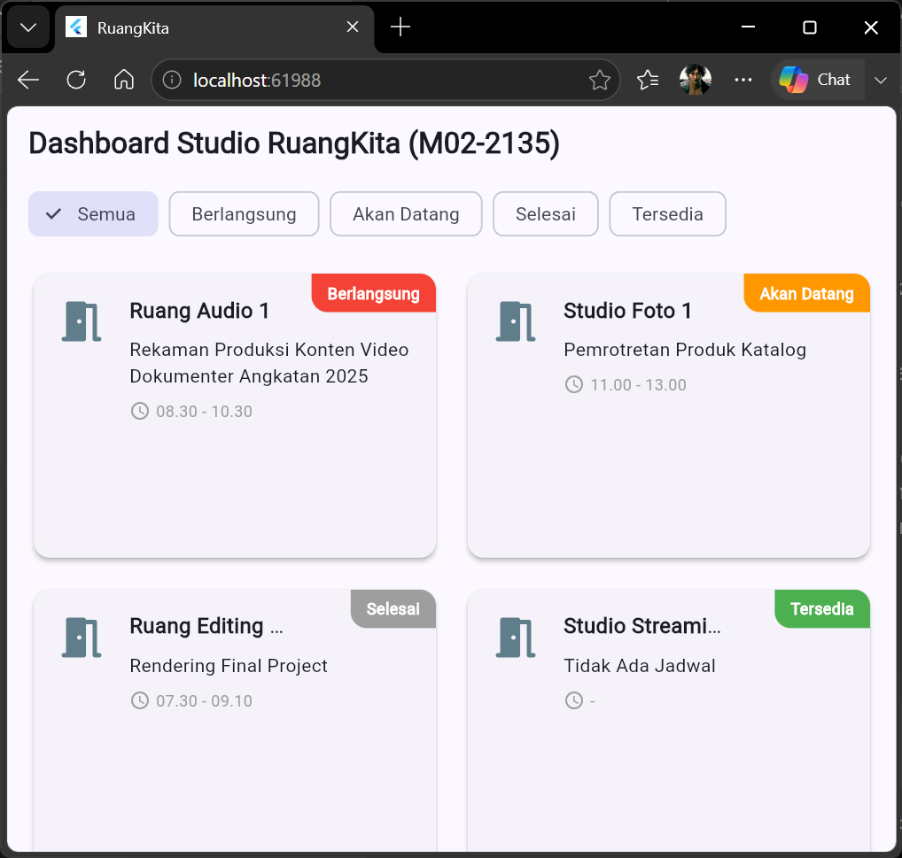
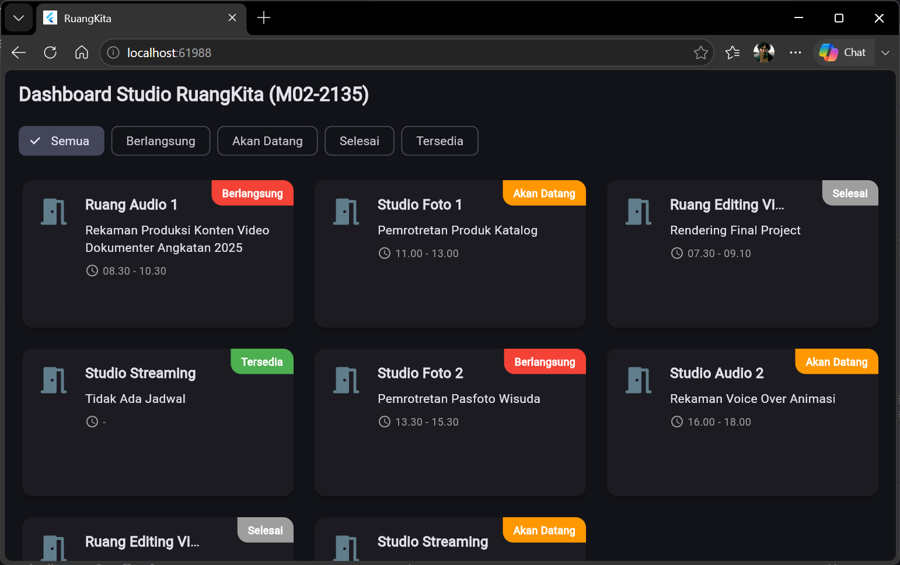
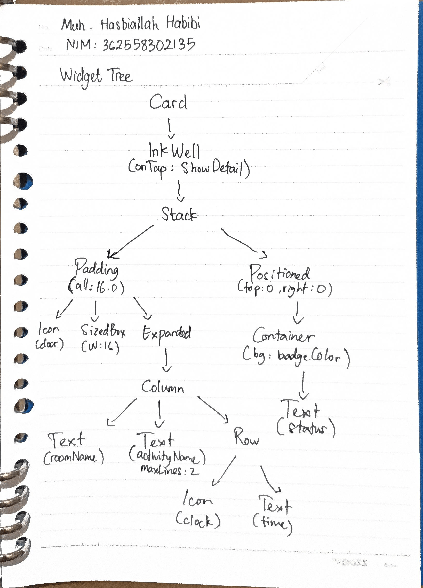

# Tugas Modul 02: RuangKita M02-2135 (Declarative UI & Responsive Layout)

**Identitas Mahasiswa**
* Nama: Muhammad Hasbiallah Habibi
* NIM: 362558302135
* Program Studi - Kelas: Teknologi Rekayasa Perangkat Lunak - 2C
* Semester: 3
* Domain Studi Kasus: Studio & Multimedia

## Deskripsi Proyek
RuangKita adalah aplikasi manajemen ketersediaan ruangan studio dan fasilitas multimedia berbasis Flutter. Aplikasi ini mengimplementasikan konsep *Declarative UI*, *Responsive Layout* (Compact, Medium, Expanded), *State Management* lokal menggunakan `StatefulWidget`, serta mengadopsi standar desain Material 3 dengan dukungan otomatis *Light/Dark Mode*.

## Jawaban Pertanyaan Refleksi

**1. Mengapa penggunaan widget `Expanded` penting dalam tata letak (layout) yang fleksibel?**
Widget `Expanded` sangat penting karena ia memaksa *child widget* di dalamnya untuk mengisi sisa ruang (*available space*) yang tersisa pada *parent* (`Row` atau `Column`), tetapi secara bersamaan **memberikan batasan tegas (constraint)** agar tidak melampaui batas layar. Tanpa `Expanded`, teks yang sangat panjang di dalam `Row` akan terus memanjang ke samping (unbounded width) dan memicu *error* "RenderFlex Overflow".

**2. Apa perbedaan menggunakan `LayoutBuilder` dan `MediaQuery` untuk membuat layout responsif?**
`MediaQuery` membaca ukuran **layar perangkat secara global** (ukuran fisik OS/Browser). Sebaliknya, `LayoutBuilder` membaca **batasan ruang (constraints) yang diberikan oleh parent widget-nya**. 
`LayoutBuilder` jauh lebih fleksibel dan modular karena ia memampukan komponen kita beradaptasi dengan ukuran kotak tempat ia diletakkan, bukan sekadar ukuran layar. Jika komponen `LayoutBuilder` dimasukkan ke dalam setengah layar layar Tablet, ia akan cerdas membaca bahwa dirinya berada di ruang sempit dan beralih ke tata letak 1 kolom, sedangkan `MediaQuery` akan tertipu mengira ia masih memiliki ruang seluas satu Tablet penuh.

**3. Jelaskan alur kerja bagaimana perubahan state pada `ChoiceChip` (ketika dipilih) dapat mengubah daftar kartu yang ditampilkan di layar!**
Alur kerjanya dimulai ketika pengguna mengetuk (tap) salah satu `ChoiceChip`. Fungsi `onSelected` akan terpanggil dan mengeksekusi `setState()`. Di dalam `setState()`, variabel `_selectedStatus` diperbarui dengan nilai kategori baru (misal: "Berlangsung"). Pemanggilan `setState()` ini memberi sinyal ke *framework* Flutter untuk merombak/me-render ulang (*rebuild*) UI melalui fungsi `build()`. Saat proses *rebuild*, fungsi getter `_filteredSessions` akan menghasilkan daftar ruangan baru yang sudah disaring sesuai status tersebut, lalu `ListView/GridView` merender ulang daftar kartu baru tersebut ke layar seketika.

## Lampiran
* **Screenshot:**    
* **Bukti Widget Tree:** 
* **Tautan Commit Final:** https://github.com/hasbihabibi/RuangKita.git